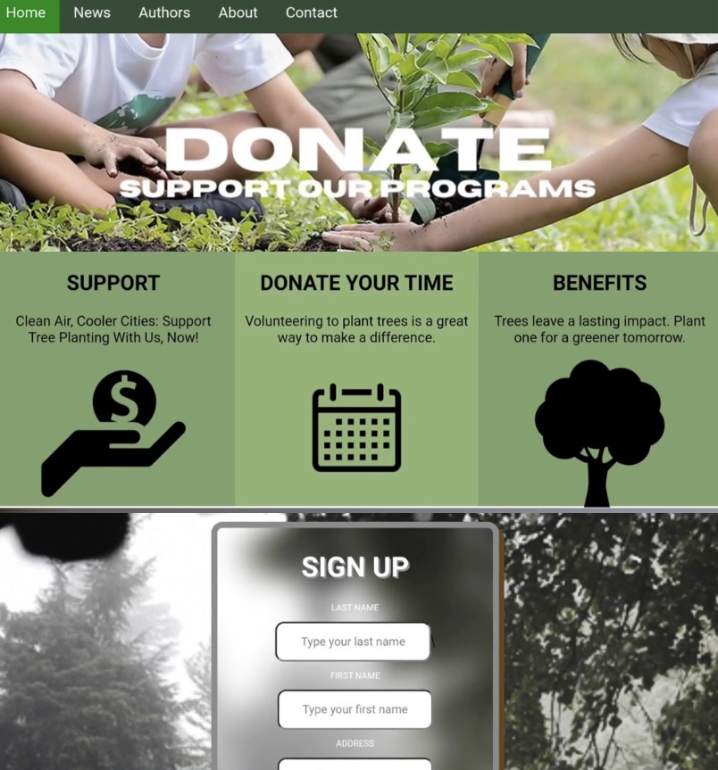

  

  

  
  
  

  

---

## About Me

Bachelor of Science in <b>Information Systems (BSIS-3)</b> student with a strong technical foundation and a primary focus on <b>user-centric design</b>. My goal is to bridge the gap between complex backend system functionality and intuitive, elegant user interfaces as a professional <b>UI/UX Designer</b>.
  
I specialize in designing modern, accessible digital layouts — including <b>dark mode</b> and <b>glassmorphic</b> designs — that elevate the overall user experience.

  

## Technical Toolbox

<table align="center">
  <tr>
    <td align="center"><b>Design & Prototyping</b></td>
    <td>
      
      
      
      
    </td>
  </tr>
  <tr>
    <td align="center"><b> Languages</b></td>
    <td>
      
      
      
      
    </td>
  </tr>
  <tr>
    <td align="center"><b> Frameworks</b></td>
    <td>
      
    </td>
  </tr>
  <tr>
    <td align="center"><b> Tools & Environments</b></td>
    <td>
      
      
      
    </td>
  </tr>
</table>

  

##  GitHub Stats

  
  

  

  

##  Selected Work Samples

<table>
  <tr>
    <td width="50%" valign="top">
      
      <h3>GreenGrow</h3>
      
GreenGrow is a digital platform designed to combat environmental decline by allowing users to financially support global tree-planting initiatives while educating them on the critical consequences of deforestation. The platform bridges the gap between awareness and action, featuring a seamless donation system alongside a curated news feed that highlights real-world ecological crises caused by tree loss. Built for eco-conscious individuals and environmental advocates, GreenGrow utilizes a modern full-stack architecture (React, Node.js, and MongoDB) and a user-centered design methodology to deliver an impactful, transparent, and highly engaging user experience.

      

        
        
        
      

      
🔗 · <a href="[INSERT LINK HERE]">Source Code</a>

    </td>
    <td width="50%" valign="top">
      
      <h3>CourtBook.</h3>
      
CourtBook. System is an intuitive scheduling platform that streamlines the booking process for sports courts or facilities by connecting users directly with administrators. The platform allows users to view real-time availability and request specific time slots on their preferred courts, while giving administrators total control to approve or decline bookings via a centralized management dashboard. Designed to eliminate scheduling conflicts and maximize court utilization, CourtBook System leverages a modern full-stack architecture and user-centered design to deliver a seamless, responsive experience for both players and facility managers.

      

        
        
        
      

      
🔗 · <a href="[INSERT LINK HERE]">Source Code</a>

    </td>
  </tr>
</table>

  

##  Currently Learning

  
  
  
  
  

##  Career Outlook & Goals

> Currently focused on advancing **UI/UX methodologies**, refining low-fidelity wireframing practices, and implementing **web accessibility standards**.
>
> Actively seeking **internships, design mentorships, or collaborative web development projects** that combine Information Systems logic with visual interface design.

  

##  Beyond the Screen

<b>Personal Interests</b> — click to expand

 

- 🏋️ **Fitness & Bodybuilding** — regular weight training for discipline, physical conditioning, and structural health.
- 🏸 **Athletics** — competitive badminton and volleyball, reinforcing teamwork and strategic thinking.
- 🎤 **Creative Arts** — music and vocal performance, plus a visual appreciation for cinematic digital art styles, especially atmospheric lighting and composition in contemporary animation.

---

  

<b>Let's build something thoughtful together.</b>

  
  
  

<!-- INSERT BOTTOM AESTHETIC GIF HERE (optional)
     e.g. 

-->
